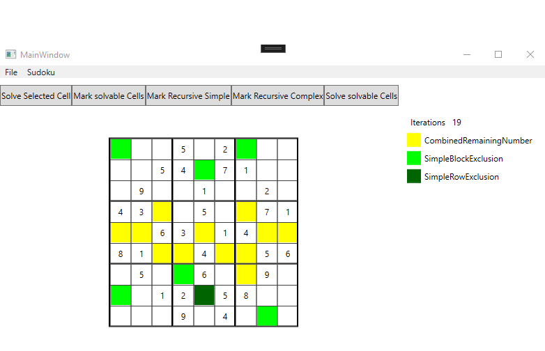
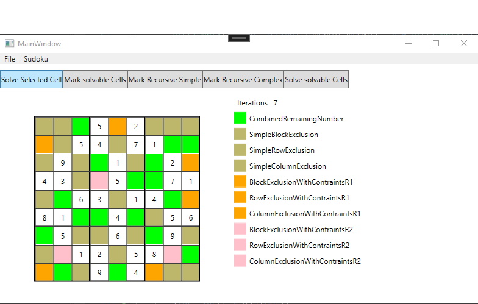

# Sudoku Solver

This simple project started because the i stumbled across [this video](https://www.youtube.com/watch?v=pezlnN4X52g) about the Phistomefel Ring.

The application can be used to explain how a sudoku can be solved  as easily as possible or with the least steeps possible.

The search for a solution for a single cell is done by executing `SolutionStrategie`s. The enum `SolutionStrategie` has a value for each strategy that exists (additionally, it has a value for `None` if a solution is requested and the cell already contains a value). The value of the strategy in the enum is sorted by complexity of the strategy (judged by my personal opinion and experience in solving Sudokus).

The recursive solving Methode allows two strategies for solving:
- `RecursiveStrategie.PreferSimpleSolution`
- `RecursiveStrategie.AllowMaxComplexity`

When searching for solutions with `PreferSimpleSolution`, the solver will retry solving all cells with a simpler `SolutionStrategy` if a solution for any cell is found. When searching with `AllowMaxComplexity`, all `SolutionStrategy`s will be used to find Solutions before before a neww iteration of all cells is started.

Example Sudoku solutions with recursive stragtegy `PreferSimpleSolution`

Example Sudoku solutions with recursive stragtegy `AllowMaxComplexity`
